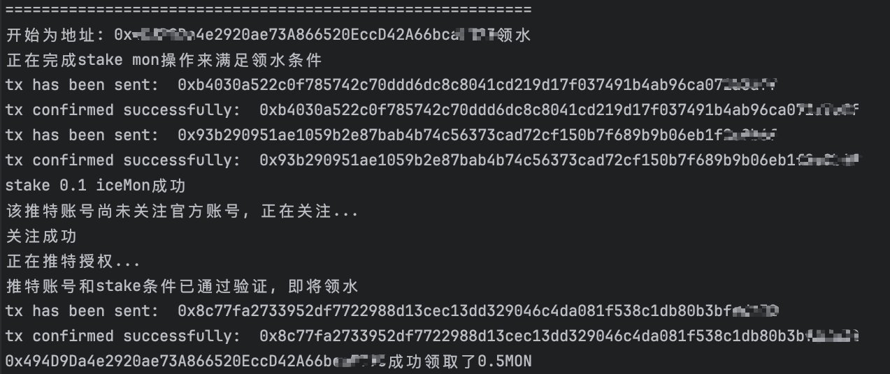
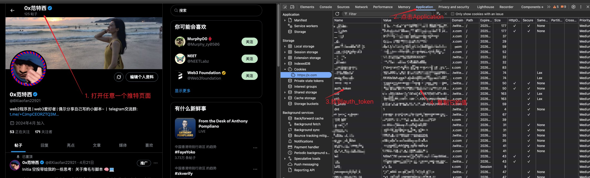

# Monad Faucet

## 📌 项目简介 / Project Overview
这是一个用于领取Monad网络测试代币MON的脚本。基于[GlacierFi](https://glacierfi.com/)项目, 通过自动stake 0.1MON和Twitter授权操作，从而领取每日的0.5 MON 代币奖励。

This is a Node.js script that **automates claiming MON test token from the [GlacierFi](https://glacierfi.com/) faucet**. It simulates a user flow by authorizing with Twitter and performing a staking action, enabling automated collection of 0.5 MON tokens daily.  

**更多脚本分享, 关注我的X: [0x范特西](https://x.com/0Xiaofan22921)**  

## 预览 / Preview


## 🚀 功能特性 / Features

- 检查 Faucet 是否可领
- 自动执行 stake 操作以满足领取条件
- 自动检测 Twitter 是否关注官方账号并执行关注
- 自动调用合约领取 0.5 MON

- Checks if the faucet is ready to claim
- Stakes required tokens to meet claim conditions
- Verifies Twitter follow status and follows if needed
- Calls smart contracts to claim 0.5 MON

## 🛠️ 使用方法 / How to Use

1. 安装依赖 / Install dependencies:

```bash
npm install
```
2. 获取twitterToken  
在推特页面按F12进入开发者模式, 完成以下操作

3. 填写配置文件 / Prepare your config:  
编辑 src/data/addresses.json文件
```json
[
  {
    "address": "EVM地址",
    "privateKey": "EVM私钥",
    "proxy": "ip代理，可以不填。格式username:password@ip:port",
    "twitterToken": "推特token"
  }
]
```
3. 执行脚本
```bash
node src/index.js <accountIndex>
```
其中\<accountIndex\>是你想使用的账号在列表中的索引。  
Where \<accountIndex\> is the index of the account to use from your JSON file.

## 注意事项
本脚本默认会关注作者X, 介意请勿使用  
This script will automatically follow the author X by default. Do not use it if you mind.

## 免责声明

本项目仅供学习研究使用，使用本项目产生的任何风险由使用者自行承担
This project is for educational and research purposes only. Any risks arising from the use of this project are the sole responsibility of the user.